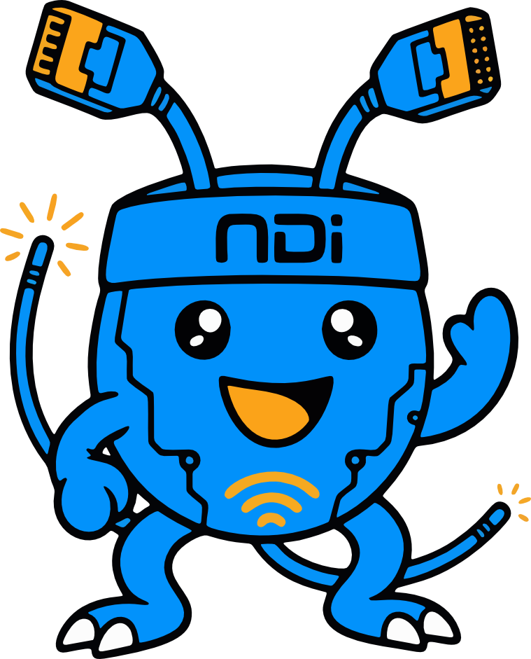

<div align="center">



# NDIMon-R

**Open-source NDI Monitor Appliance for Rockchip SBCs**

*A BirdDog Play replacement — built from scratch, entirely free.*

[](LICENSE)
[](https://github.com/markfen88/NDIMon-R)
[](https://claude.ai)

---

> **🤖 A Note From the Creator**
>
> This entire project — every line of Python, every GStreamer pipeline, every HTML template, every systemd unit, and every debugging session — was **100% vibe coded with Claude AI**. I am not a software engineer. I had an idea, a single-board computer, and a very patient AI. What you're looking at is the result of a genuinely collaborative experiment in AI-assisted development.
>
> **Claude Stats (approximate, across all sessions):**
> | Metric | Estimate |
> |--------|----------|
> | 🕐 Total Development Time | ~16–20 hours across 4+ sessions |
> | 💬 Conversation Turns | 200+ back-and-forth exchanges |
> | 🧠 Tokens Used | ~4–6 million tokens (input + output) |
> | 📅 Development Period | March 7–9, 2026 |
> | 🔁 Context Windows | 4+ (with mid-session compaction) |
> | 🐛 Bugs Squashed Live | Too many to count |
>
> Special thanks to Claude Sonnet 4.6 for being an extraordinary engineering partner.

</div>

---

## What Is NDIMon-R?

NDIMon-R is a self-contained **NDI video monitoring appliance** designed to run headlessly on low-cost Rockchip single-board computers. It receives NDI streams from the network and outputs them directly to HDMI displays — no desktop environment, no GPU drivers, no nonsense.

It is designed as a **direct replacement for the BirdDog Play**, providing similar (and in some ways greater) functionality at a fraction of the cost, using entirely open-source software.

The device is managed entirely through a **clean, responsive web UI** accessible from any browser on the network.

---

## Supported Hardware

| Board | SoC | Max Resolution | HW Decoder |
|-------|-----|---------------|------------|
| **Radxa Rock 5B** | RK3588 | 4K60 | `rkmppdec` / `mppvideodec` |
| **Radxa Rock Pi 4B+** | RK3399 | 1080p60 | `mppvideodec` |
| **Raspberry Pi 5** | BCM2712 | 1080p60 | `v4l2h264dec` |
| Generic ARM64 | Any | 1080p (SW) | `avdec_h264` |

All boards output via **KMS/DRM directly to HDMI** — no X11, no Wayland, no display server required.

---

## Features

### Core Video
- **NDI / NDI\|HX2 / NDI\|HX3** source reception
- **Direct HDMI output** via GStreamer `kmssink` (KMS/DRM — no desktop required)
- **Multi-display support** — each HDMI connector managed independently
- **Hardware-accelerated decode** on Rockchip via Rockchip MPP (Media Process Platform)
- **Scaling modes** per display: Letterbox, Stretch, Crop
- **Chroma format selection**: NV12 (HW path) or RGB/BGRx
- **Custom output resolution** and framerate per display (auto-detects preferred EDID mode)

### NDI Source Management
- **Automatic NDI discovery** via NDI SDK (multicast / mDNS)
- **NDI Discovery Server** integration — point at a server IP for managed environments
- **Direct source host probing** — enter any NDI source's host IP to find it without a discovery server
- **Auto-reconnect** — if a source drops, NDIMon-R reconnects automatically
- **Backup source** failover — automatically switch to a backup NDI source on loss
- **Source caching** — URLs cached for instant reconnection without discovery delay
- **NDI Groups** support — filter sources by group name (e.g. `Public`, `Studio A`)
- **NDI Bandwidth** control — Highest, Lowest (Proxy), or Audio Only

### Splash Screen
- Displayed on HDMI while no NDI source is active
- **Custom logo** upload (PNG with transparency supported)
- **Background color** picker
- **Overlay** showing device alias and IP address (top-right, subtle)
- **Resolution-aware** — auto-detects preferred display resolution from EDID

### Channel Banner
- On-screen banner shown briefly when switching NDI sources
- Configurable duration (0 = disabled)
- Font color and **keyed/transparent mode** options

### On-Screen Display (OSD)
- Permanent source name + IP overlay during playback
- Configurable timeout, color, and keyed mode

### PTZ Camera Control
- Full **Pan / Tilt / Zoom / Focus / Exposure / White Balance** control
- Virtual joystick in the web UI
- **USB gamepad support** — plug in any gamepad for hands-on PTZ
- **Preset save/recall** — up to 8 named presets per source
- Per-source PTZ configuration stored persistently

### Audio
- **NDI embedded audio** passthrough to HDMI
- Configurable audio sink: Auto, HDMI 1, HDMI 2, Analog/3.5mm
- **Volume control**

### Multi-View
- **Quad 2×2 layout** — monitor up to 4 NDI sources simultaneously on one display
- Configurable per slot

### Recording
- **Per-display MP4 recording** to local storage
- Configurable output path

### Tally Lights
- **GPIO tally output** — green (live) and red (preview) signals
- Compatible with physical tally hardware via GPIO pins

### HDMI CEC
- **Channel Up / Down** on the remote cycles through discovered NDI sources
- Works with any CEC-compatible display via `cec-client`

### System
- **CPU governor** auto-set to `performance` at startup for lowest decode latency
- **HDMI hotplug** detection — splash refreshes automatically on reconnect
- **Crash-recovery backoff** — after 3 fast failures, pauses retries to avoid loops
- **Single-instance lock** — prevents duplicate pipeline workers
- **Config backup / restore** — download or upload a full config ZIP from the UI

### Network
- **DHCP or static IP** configuration via web UI
- DNS server configuration

### Security
- Optional **password protection** on the web UI
- Persistent session key

---

## The Web Interface

NDIMon-R is controlled through a three-page web UI accessible at `http://<device-ip>:8080`.

### Dashboard (`/`)

The home page gives you a live overview of the entire system at a glance.

**System Stats Bar (top):**
- CPU usage %
- Memory usage %
- System uptime
- Board model
- CEC status (OK / Off / N/A / Error)
- Live temperature readouts for each thermal zone

**Display Cards:**
One card per connected HDMI output, showing:
- Live / Idle status indicator with animated pulse
- Currently playing NDI source name
- Stream uptime
- Input resolution and framerate (e.g. `1920×1080 @ 59.94fps`)
- Input pixel format
- Output resolution

**NDI Sources Panel:**
All NDI sources currently visible on the network, with active sources highlighted.

---

### NDI Page (`/ndi`)

The main control surface for source selection and per-display configuration.

**Per-Display Controls:**
- NDI source selector (dropdown of all discovered sources)
- Scaling mode: Letterbox / Stretch / Crop
- Chroma format: NV12 / RGB
- Output resolution: Auto (EDID preferred) or manual selection
- Output framerate
- Backup source (auto-failover)
- Start / Stop stream button

**PTZ Control Panel** (per source):
- Virtual joystick for Pan/Tilt
- Zoom, Focus, Iris sliders
- White Balance and Exposure controls
- Preset save/recall (up to 8 per source)
- USB gamepad mapping

**NDI Settings:**
- **NDI Alias** — friendly name shown to other NDI tools on the network
- **Bandwidth** — Highest / Lowest (Proxy) / Audio Only
- **Discovery Servers / Source IPs** — comma-separated list of NDI discovery server IPs or direct NDI source host IPs. Works with or without a dedicated discovery server.
- **NDI Groups** — one group name per line to filter visible sources

**Audio Settings:**
- Enable / disable audio
- Audio sink selection
- Volume

---

### Settings Page (`/settings`)

System-level configuration organized into tabs.

#### Multi-View Tab
- Enable/disable Multi-View mode
- Assign up to 4 NDI sources to quad layout slots

#### Splash Tab
- Upload custom logo (PNG)
- Background color picker
- Toggle IP/alias overlay
- Splash output resolution (Auto / 1080p / 720p / 4K / 1024×768)
- Channel banner duration (seconds, 0 = disabled)
- OSD: enable/disable, color, keyed mode, timeout

#### Recording Tab
- Per-display recording path configuration

#### Network Tab
- Interface selection
- DHCP / Static mode
- IP address, netmask, gateway, DNS

#### System Tab
- HDMI CEC enable/disable
- CEC device name
- Password protection (enable, set password)
- Config backup (download ZIP)
- Config restore (upload ZIP)

---

## NDI Discovery — How It Works

NDIMon-R uses a **multi-layered discovery approach** to find NDI sources:

1. **NDI SDK native discovery** — The NDI library queries the network using multicast/mDNS. This works automatically on most LANs where multicast is permitted.

2. **NDI Discovery Server** — For managed environments (broadcast facilities, production networks), point NDIMon-R at your NDI Discovery Server IP. The server maintains a registry of all NDI sources and removes the dependency on multicast.

3. **Direct Source IP probing** — No discovery server? No multicast? You can enter the IP address of *any host running NDI sources* directly into the Discovery Servers / Source IPs field. NDIMon-R will probe that host directly and enumerate its sources — no multicast or dedicated discovery infrastructure required.

4. **Avahi mDNS fallback** — As a last resort, NDIMon-R queries `avahi-browse` for `_ndi._tcp` services on the local network.

The NDI SDK config (`~/.ndi/ndi-config.v1.json`) is written automatically at startup, so `gst-launch` pipelines also have access to the discovery configuration from the moment the service starts.

---

## Architecture

```
NDI Network
    │
    ▼
NDI SDK (libndi.so.6)
    │
gst-plugin-ndi (libgstndi.so)
    │
GStreamer Pipeline (gst-launch-1.0)
    ├── ndisrc → demux → videoconvert → [RGA scaler] → kmssink ──► HDMI Output
    └── ndisrc → demux → audioconvert ──────────────────────────► HDMI Audio
    
Flask Web App (app.py, port 8080)
    ├── /              → Dashboard
    ├── /ndi           → NDI Source Control + PTZ
    ├── /settings      → System Configuration
    └── /api/*         → JSON REST API (status, sources, stream control)

systemd: ndi-monitor.service
    └── python3 app.py (single worker, PID lock)
```

---

## Installation

> Full installation script coming soon. Current setup requires manual steps on Armbian or Radxa Debian.

**Dependencies:**
- Python 3 + Flask + Pillow
- GStreamer 1.0 with `kmssink`, `videoconvert`, `videoscale`, `textoverlay`
- NDI SDK v6 (`libndi.so.6`) — [NewTek/Vizrt NDI SDK](https://ndi.video/for-developers/ndi-sdk/)
- `gst-plugin-ndi` (`libgstndi.so`) — [teltek/gst-plugin-ndi](https://github.com/teltek/gst-plugin-ndi)
- Rockchip MPP packages: `librockchip-mpp1`, `gstreamer1.0-rockchip1`
- `modetest`, `cec-client`, `avahi-utils`

**Service:**
```bash
# Status
systemctl status ndi-monitor

# Logs
journalctl -u ndi-monitor -f

# Restart
systemctl restart ndi-monitor

# Update
/opt/ndi-monitor/update.sh
```

---

## Known Limitations

- **NDI Advanced SDK (dev license)**: Streams cut after 30 minutes. A standard/production NDI SDK license is required for uninterrupted operation.
- **RK3588 display detection**: After disabling a display server (GDM3/etc.), HDMI may require a physical unplug/replug to register in the DRM subsystem.
- **Multicast NDI**: Some networks (with IGMP snooping or restrictive switches) block NDI multicast. Use a Discovery Server or direct IP in those environments.

---

## License

Apache 2.0 — See [LICENSE](LICENSE)

---

<div align="center">

*Built with ❤️ and a whole lot of AI on a Radxa Rock 5B.*

*[github.com/markfen88/NDIMon-R](https://github.com/markfen88/NDIMon-R)*

</div>
